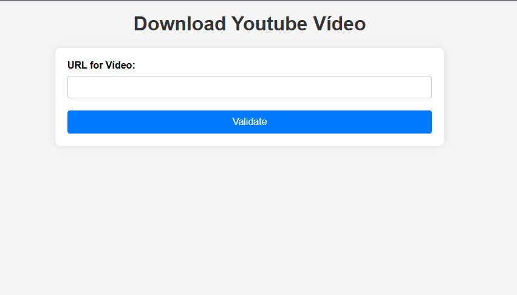
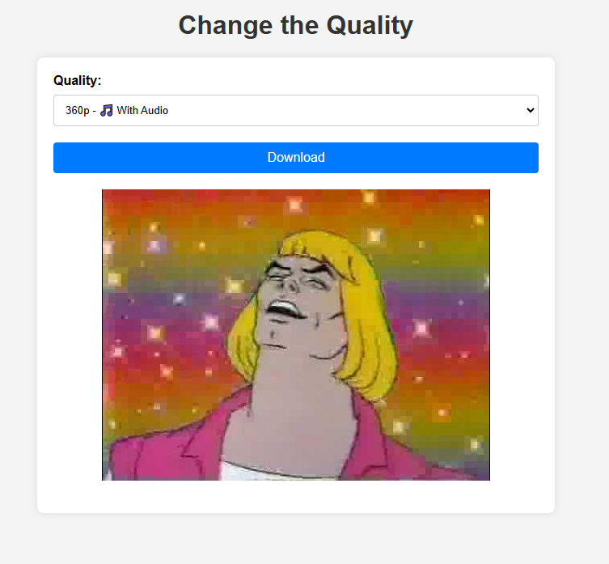

# YouTube Video Downloader

This project is a simple web application that allows users to download YouTube videos by providing the video URL. The application is built using Go and the `github.com/kkdai/youtube/v2` package.

## Features

- Fetch video information from YouTube
- Display available video formats
- Download selected video format

## Requirements

- Go 1.16 or later

## Installation

1. Clone the repository:
    ```sh
    git clone https://github.com/yourusername/youtube-get-video.git
    cd youtube-get-video
    ```

2. Install dependencies:
    ```sh
    go mod tidy
    ```

## Usage

1. Run the application:
    ```sh
    go run cmd/web/main.go
    ```

2. Open your web browser and navigate to `http://localhost:8080`.

### Enter the YouTube video URL and click the `Get Video` button.


### Select the desired video format and click the `Download` button.


## Project Structure

- `cmd/go-youtube-download/main.go`: Entry point of the application.
- `internal/youtube/client.go`: Contains the YouTube client setup and functions to fetch video information and streams.
- `internal/handlers/validate.go`: Contains the handler for validating and displaying video formats.
- `web/templates/formats.html`: HTML template for displaying video formats.
- `web/static/`: Directory for static files (CSS, JS, etc.).

## License

This project is licensed under the MIT License. See the [LICENSE](LICENSE) file for details.